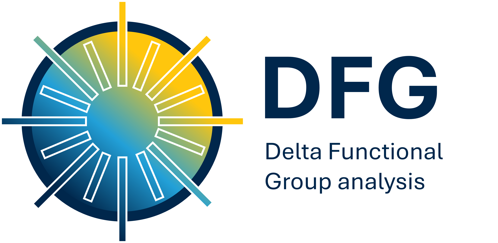

  

# DFG: Delta Functional Group analysis
**Quantifying functional group distributions from AMS data sets**

## Overview
**AMS Delta Functioanl Group analysis (DFG)** is a Python-based workflow designed to deconvolve High-Resolution Aerosol Mass Spectrometer (HR-AMS) data sets into specific chemical functional groups. This method allows for the quantification of the relative fractions of five functional groups: alkyls, aromatics, alcohols, carboxylic acids, and ketones.

## Citation
If you use this tool or this method for you research, please cite: 
O'Brien et al., "Application of a Chemical Index to Aerosol Mass Spectrometry: Delta Plots and Functional Group Distributions" ES&T Air 2026. 
Note: this will be updated once the full citation is avaiable.

## Key Features
**Radial Delta Plots:** Visualize the distribution of carbon, hydrogen, and oxygen containing fragments. 

**Functional Group Quantification:** An algorithm tested against standards and FTIR data to provide chemical characteristics of the mixtures

## Getting Started
### Data Requirements
Two code blocks are included here for delta analysis of AMS data. The first generates radial delta plots for carbon, hydrogen, and oxygen containing fragments (Delta_plot_). The second calculates the functional group distribution for an AMS mass spectrum (Delta_functional_groups_). 

To use these code blocks, data sets must be '.csv' files with the following columns:
1. 'mass': the m/z value.
2. 'formula': the assigned ion formula
3. 'frac_abundance': the fractional abundance of the ion (the data should be **normalized** to a sum of 1 for all the ion intensities)

### How to Run
1. **Open Google Colab:** Go to [colab.research.google.com](https://colab.research.google.com).
2. **Import from GitHub:** On the opening "Select File" screen, click the **GitHub** tab. 
3. **Link the Repo:** Paste this repository link: `https://github.com/reobrien1/AMS_delta_functionalgroups` and select the notebook you wish to run.
4. **Connect your Data:** We recommend storing your `.csv` data files in a folder on your **Google Drive**. 
    * Ensure you run the "Mount Google Drive" step in the notebook to allow Colab to access your files.
    * Update the file path in the **"Import your data"** code block to match your specific folder location.
5. **Execute:** Once the path is set, go to the **Runtime** menu at the top and select **"Run all"**. Your generated figures and functional group distributions will be displayed at the bottom of the page.

> **Tip:** If the code fails to run, double-check the file name and that your CSV column headers exactly match the requirements (`mass`, `formula`, `frac_abundance`) and that your data is normalized to a sum of 1.

### Stay Updated
We are continuously refining this tool as new standards and validation data are integrated. Please check back regularly for updates to the deconvolution algorithm and expanded example datasets.

**To stay informed of the latest versions:**
* **Watch:** Click the **"Watch"** button at the top of this repository to receive notifications when we release code updates or new features.
* **Star:** **"Star"** this project to save it to your GitHub profile for easy access and to support the visibility of this tool in the atmospheric science community.

## Support and Feedback
We appreciate feedback! If you encounter performance issues or have suggestions for refinement, please let us know. For questions please reach out to Rachel O'Brien (reobrien@umich.edu). If you have issues, feel free to open an Issue in this GitHub repostiory to report bugs. We are unable to provide extensive individual troubleshooting for all data sets, but we will do our best to answer questions about the algorithm's logic and setup.

----
*Developed at the University of Michigan*
